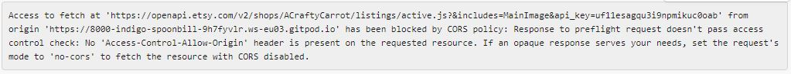
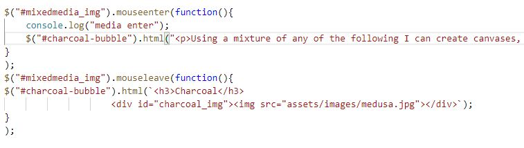

<h4>Manual Testing</h4>

<h3>Manual Testing of User Stories</h3>
<ol>
<li>I would like to be able to browse and purchase items that are for sale by the artist.</li>
<ul>
<li>From the home page, there is a quick link to "My Shop" from where all of the current items for sale are displayed. By clicking on the "Buy Now" button, the items can be purchase via the Etsy website.</li>
</ul>
<li>I would like to be able to see a gallery of artwork created by the artist to see if the styles and designs are what I am looking for.</li>
<ul>
<li>When the homepage loads, it is easy to see where to access the gallery. By clicking on the "My Artwork" link, it takes the user directly to a gallery of many different types of art created by the artist. There are also examples of her work on the Homepage which are one of the first things that are seen when the page loads.</li>
</ul>
<li>As a local customer, I would like to be able to easily find the address and location of the artists studio so I can view the artwork in person. </li>
<ul>
<li>From the homepage, it is a simple navigation to the "Contact Me" page where the address is provided. The location of the studio is also visually represented on Google Maps.</li>
</ul> 
<li>I would like to be able to contact the artist for personalised artwork and for a quote.</li>
<ul>
<li>It is easy to see where, as a user, you would find these details. Clicking on the "Contact Me" link takes you straight to the page where the contact form can be completed. The contact form asks for details of the artwork required by the user. There is also the option to call the artist which is displayed boldly on the same page. Also, the footer of each page displays a link to the contact form.</li>
</ul>
<li>I would like to be able to follow the artist on social media so I can keep up to date with new artwork that is available.</li>
<ul>
<li>An easy link in the footer of each page will direct you to the artist's Instagram page and allows you to follow them.</li>
</ul>
<li>I would like to be able to navigate between the webpages without having to return to the homepage.</li>
<ul>
<li>Each page has the same header which has links to each page on the website, therefore you can navigate to any page from any location on the website.</li>
</ul>
</ol>

<h3>Manual Testing of key aspects of the website</h3>
I manually tested the following to make sure they worked as designed:

<h5>Navbar</h5>
<ul>
<li>Viewing the Navbar from each of the three pages, it looks identical.</li>
<li>There are three options: Home, Services, Contact.</li>
<li>Clicking on the Home link will takes you to the index.html page.</li>
<li>Clicking on the My Artwork link takes you to the myartwork.html page.</li>
<li>Clicking on the My Shop link takes you to the myshop.html page.</li>
<li>Clicking on the Contact Me link takes you to the contactme.html page.</li>
</ul>

<h5>Link to Instagram</h5>
<ul>
<li>Scroll to the footer and the link is displayed in the form of the Instagram icon.</li>
<li>Upon clicking on the link, a new tab is opened and the artist's Instagram page is displayed.</li>
</ul>

<h5>Contact Form</h5>
<ul>
<li>Click on the "Contact Me" link.</li>
<li>Submitting the form without a name is not permitted. A warning appears "Please fill in this field".</li>
<li>After entering a name and trying to submit, a warning "Please fill in this field" appears below the phone number box.</li>
<li>After entering a phone number and trying to submit, a warning "Please fill in this field" appears below the emaill address box.</li>
<li>After entering an emaill address and trying to submit, a warning "Please fill in this field" appears below the requirements box.</li>
<li>Therefore the form cannot be submitted without all of the required items.</li>
<li>When all of the sections of the forms are completed, and upon clicking the "Send me your request" button, the details are emailed to the email address I have entered in emailJS.</li>
<li>Once the button has been clicked and the details sent successfully, the form will reset to its original state i.e. the input boxes are blank.</li>
</ul>

<h5>Loading the Etsy API and loader GIF</h5>
<ul>
<li>After clicking on the My Shop link, the page starts to load.</li>
<li>Before the JavaScript is loaded, the header and footer appear and so does the loader GIF to show the user that further information will be displayed.</li>
<li>Once the information from the API is loaded onto the page, the loader GIF is removed.</li>
</ul>

<h5>Etsy API Data - does the data parse correctly?</h5>
<ul>
<li>Once the JavaScript is run, the following data should have been retrieved from the API: Listing title, listing image, listing currency, listing price & listing url.</li>
<li>The image is displayed as a 170x135px image and is also used as a link to the listing url on Etsy</li>
<li>The listing title is displayed below along with the price and currency code.</li>
<li>The button titled "Buy Now" uses the listing url to provide a link to the listing on Etsy which opens in a new tab.</li>
</ul>

<h5>Home Page JavaScript - Charcoal, Pencil, Mixed Media & Acrylic</h5>
<ul>
<li>When hovering over each div for these four items the contents should change to display more information about each media type.</li>
<li>Hovering over each of the four divs does remove the original image and contents of the div and replaces them with more information.</li>
<li>When the mouse is moved outside the div, the contents revert back to the original html contents.</li>
<li>This method works for all screen sizes as although on smaller screens, there may not be a mouse present i.e. on a tablet or phone, if no mouse present the action still works when the div's are clicked on.</li>
</ul>

<h5>Different Screen Sizes</h5>
<ul>
<li>On a mobile device</li>
<ul>
<li>The header is condensed but all the page links are still visible. As the header is fixed to the top, the links can be accessed no matter how far down the page your are</li>
<li>The hero image is visible and the sections are placed under each other and take up the full width of the screen</li>
<li>The footer allows the contact details to be stacked on top of each other and still easily accessed</li>
<li>The services boxes are stacked on top of each other and are full width</li>
<li>The contact form appears in the middle of the page</li>
</ul>
<li>On a tablet</li>
<ul>
<li>The header is condensed but all the page links are still visible to the right hand side. As the header is fixed to the top, the links can be accessed no matter how far down the page your are</li>
<li>The hero image is visible and the sections are placed next to each other</li>
<li>The footer items are still visible next to each other</li>
<li>The services boxes are in a grid system with two boxes per row</li>
<li>The contact form is still visible in the center of the page</li>
</ul>
<li>On a desktop</li>
<ul>
<li>The header items are linear and span the width. Also the icons are visible at each end of the header. As the header is fixed to the top, the links can be accessed no matter how far down the page your are</li>
<li>The hero image is visible and the sections are placed next to each other</li>
<li>The footer items are visible next to each other</li>
<li>The services boxes are in a grid system with two boxes per row but wider than a tablet</li>
<li>The contact form is visible in the center of the page and the email and phone number are shown at each side</li>
</ul>
</ul>

<h3>Bugs Discovered</h3>
Here are details of bugs that were discovered during manual testing and how they were rectified.

<ul>
<li>Etsy API</li>
<ul>
<li>When first implementing the Etsy API into my project, the GET JSON call was being blocked by CORS policy. See image below.</li>

<li>I tried to get around this by using a header and (Access-Control-Allow-Origin: *) however the API data was still being blocked.</li>
<li>After speaking to "Tutor Support" they advised using an ajax call and jsonp to call the data, which solved the CORS policy issue.</li>
</ul>

<li>Bubbles.js</li>
<ul>
<li>My inital idea for the charcoal, pencil, acrylic & mixed media blocks was that when the mouse hovered over one of the divs, the div next to it would be filled with the information.</li>
<li>The original code was written for each div as below:</li>

<li>Despite not logging any errors in the console, it appeared that only the first two divs to be hovered over worked.</li>
<li>After speaking to "Tutor Support" they suggested changing the function to affect the same div rather than the div next to it.</li>
<li>This fixed the issu described.</li>
</ul>

<li>EmailJS Reset</li>
<ul>
<li>Initially, when the contact form was filled in and submitted, the data in the fields did not clear.</li>
<li>After reviewing the JavaScript code in sendEmail.js I realised that the "document.getElementById("myForm").reset();" was actually outside the function.</li>
<li>By moving this inside the function and only when "success" was logged in the console, the form was reset once the form was successfully submitted.</li>
</ul>
</ul>
